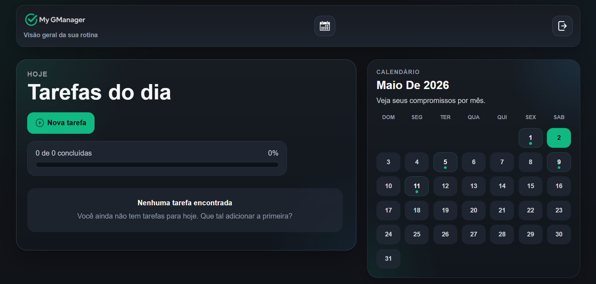
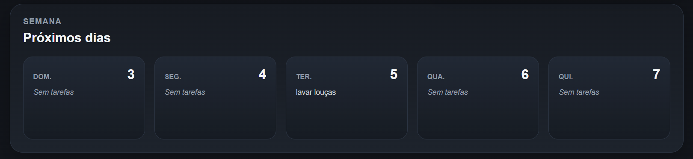
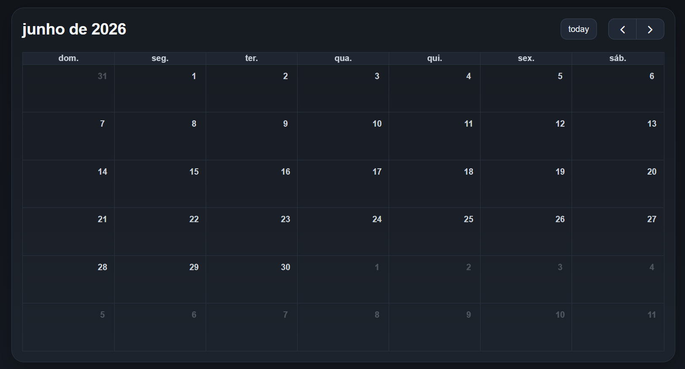

# My GManager

Organizador pessoal full-stack para gestão de tarefas, planejamento diário e visão mensal de compromissos.

Em produção, o projeto será publicado em https://mygmanager.com.br/

## Visão geral

O My GManager nasceu como uma ferramenta pessoal de organização e evoluiu para uma aplicação completa com:

- autenticação com refresh token
- verificação de email com Resend
- dashboard com tarefas do dia
- visão semanal
- calendário mensal interativo
- página dedicada para cada dia
- base preparada para novas áreas como notas, checklists, finanças e eventos futuros

## Stack

- Frontend: React, Vite, React Router, FullCalendar
- Backend: Node.js, Express
- Banco de dados: PostgreSQL
- Autenticação: JWT + refresh token em cookie `httpOnly`
- Email transacional: Resend

## Imagens

## Dashboard


## Área da semana


## Área do calendário


## Rodando localmente

### 1. Instale as dependências

```bash
cd backend
npm install
```

```bash
cd frontend
npm install
```

### 2. Configure o ambiente

Crie o arquivo `backend/.env` com base no `.env-example` e preencha as variáveis do projeto, incluindo:

- conexão com PostgreSQL
- segredos de autenticação
- chave da Resend
- domínio/frontend URL

### 3. Inicie o projeto

Backend:

```bash
cd backend
npm run dev
```

Frontend:

```bash
cd frontend
npm run dev
```

## Scripts principais

### Backend

```bash
npm run dev
```

### Frontend

```bash
npm run dev
npm run build
npm run preview
npm run lint
```
## Autor

Projeto desenvolvido por Glezier Montalvane como ferramenta real de organização pessoal e estudo prático de desenvolvimento full-stack.