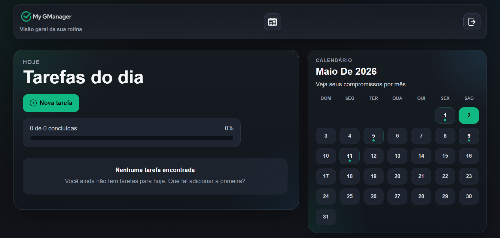
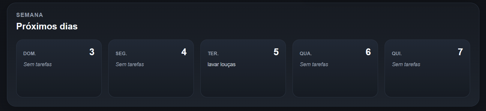
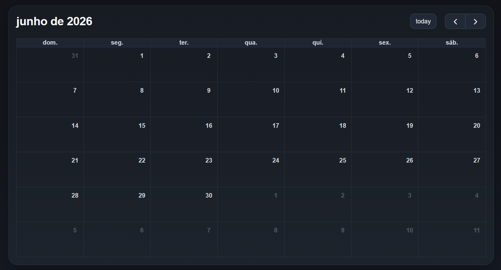

# My GManager

Organizador pessoal full-stack para gestão de tarefas, planejamento diário e visão mensal de compromissos.

O projeto está disponível em https://mygmanager.com.br/

## Visão geral

O My GManager nasceu como uma ferramenta pessoal de organização e evoluiu para uma aplicação completa com:

## Principais funcionalidades

- Autenticação com JWT e refresh token em cookie httpOnly
- Login com Google
- Verificação de email e recuperação de senha via Resend
- CRUD de tarefas
- Dashboard diário e visão semanal
- Calendário mensal com FullCalendar
- Página individual por dia
- Exportação de tarefas por dia/período em PDF e WhatsApp
- Backend organizado em controllers, services, repositories e validators
- Deploy em produção com Vercel + Neon PostgreSQL

## Stack

- Frontend: React, Vite, React Router, FullCalendar
- Backend: Node.js, Express
- Banco de dados: PostgreSQL
- Autenticação: JWT + refresh token em cookie `httpOnly`
- Email transacional: Resend

## Imagens

## Dashboard


## Área da semana


## Área do calendário


## Rodando localmente

### 1. Instale as dependências

```bash
cd backend
npm install
```

```bash
cd frontend
npm install
```

### 2. Configure o ambiente

Crie o arquivo `backend/.env` com base no `.env-example` e preencha as variáveis do projeto, incluindo:

- conexão com PostgreSQL
- segredos de autenticação
- chave da Resend
- domínio/frontend URL

### 3. Inicie o projeto

Backend:

```bash
cd backend
npm run dev
```

Frontend:

```bash
cd frontend
npm run dev
```

## Autor

Projeto desenvolvido por Glezier Montalvane como ferramenta real de organização pessoal e estudo prático de desenvolvimento full-stack.

## Licença

Este projeto está sob a licença MIT. Consulte o arquivo [LICENSE](LICENSE) para mais detalhes.